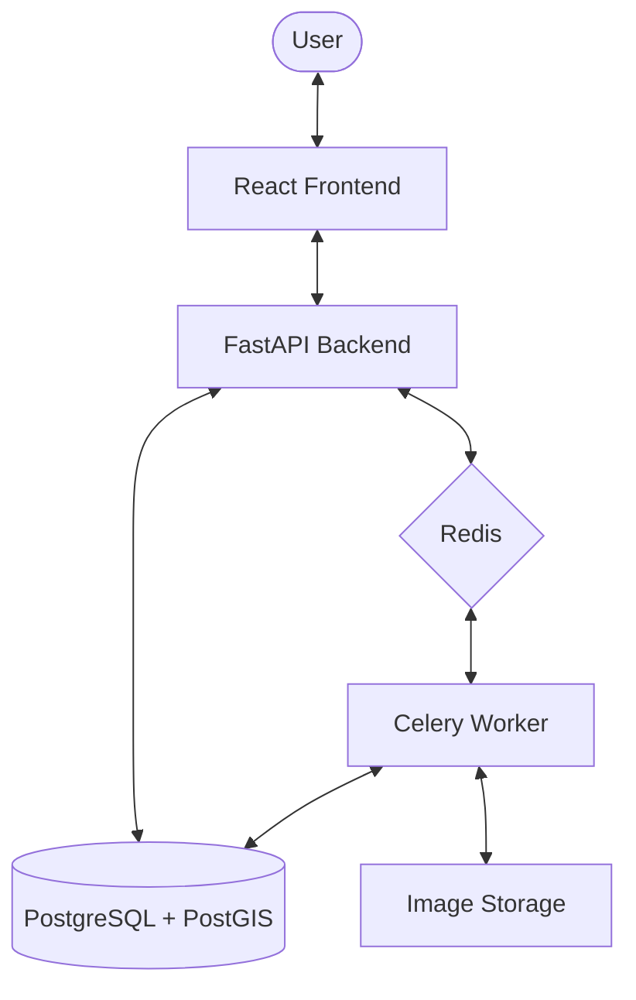

# AstroCat Architecture

AstroCat is a comprehensive web application designed for cataloging, indexing, and searching astronomical imaging data. This document provides a high-level overview of the system components and their interactions.

## System Overview

AstroCat uses a modern containerized architecture consisting of a React frontend, a FastAPI backend, a PostgreSQL database with PostGIS, and a Celery-based background processing pipeline.

## Technology Stack

| Layer | Technologies |
|-------|--------------|
| **Frontend** | React 18, Vite, TanStack Query, Vanilla CSS |
| **Backend** | Python 3.12, FastAPI, SQLAlchemy 2.0, Alembic |
| **Database** | PostgreSQL 16, PostGIS 3.4 (Spatial Support) |
| **Task Queue** | Celery, Redis |
| **Scientific** | Astropy (FITS/WCS), Pillow, rawpy |
| **Deployment** | Docker, Docker Compose |

## Key Components

### 1. Frontend (React)
A responsive single-page application focused on data visualization and search. It uses a custom "Deep Space" design system implemented with CSS variables for high performance and visual consistency.

### 2. Backend API (FastAPI)
The central nervous system of the application, providing RESTful endpoints for image management, searching, and system statistics. It handles authentication (if configured) and coordinates between the database and background workers.

### 3. Background Workers (Celery)
Dedicated workers for computationally intensive tasks:
- **Filesystem Scanning**: Discovering new images across multiple mount points.
- **Metadata Extraction**: Parsing FITS headers and EXIF data.
- **Catalog Matching**: Performing spatial queries to associate images with Messier/NGC objects.
- **Thumbnail Generation**: Creating WebP previews for FITS, RAW, and JPG files.

### 4. Spatial Database (PostGIS)
Unlike standard databases, AstroCat leverages PostGIS for spherical geometry. This allows for:
- Finding images that contain specific RA/DEC coordinates.
- Calculating image field boundaries on the celestial sphere.
- Matching images to star catalogs based on angular separation.

## Data Flow

### Ingestion Pipeline
1. **Scan**: The user triggers a scan via the UI.
2. **Discover**: The backend identifies new files in monitored directories.
3. **Queue**: Files are sent to Celery for processing.
4. **Extract**: Workers parse metadata (Exposure, Camera, etc.) and plate-solve data (WCS).
5. **Match**: The system identifies celestial objects within the image's field of view.
6. **Store**: All metadata and matches are persisted to the database.

### Search & Discovery
1. **Query**: The user applies filters (Object name, RA/DEC radius, Exposure time, etc.).
2. **Execute**: The API performs complex SQL joins and spatial intersections.
3. **Present**: Results are returned with lazy-loaded thumbnails for a smooth browsing experience.
