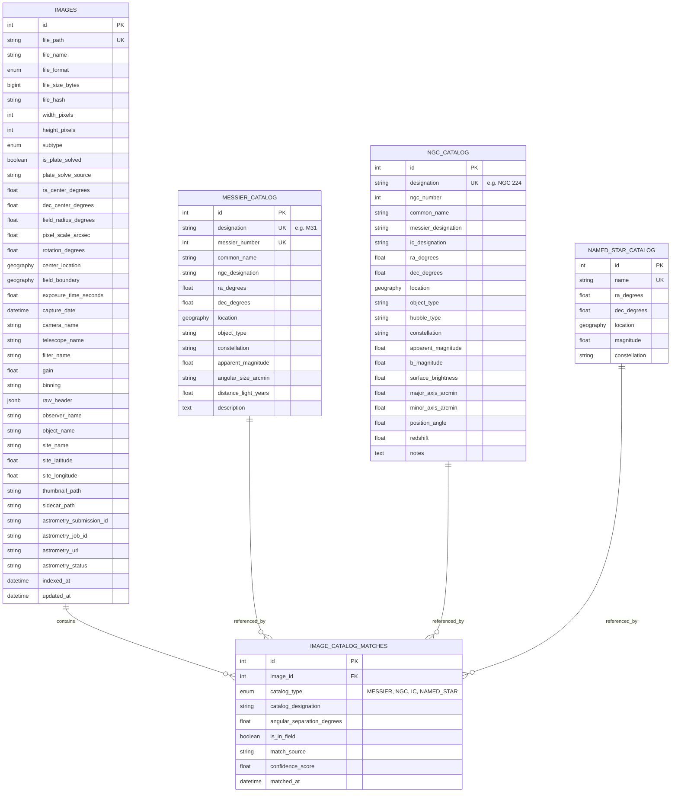

# AstroCat Data Model

This document outlines the database schema for the AstroCat application. The database is powered by **PostgreSQL** with the **PostGIS** extension for spatial queries.

## Entity Relationship Diagram

## Tables

### 1. Images (`images`)
The core table storing metadata for every indexed astronomical image.

| Column | Type | Nullable | Description |
|--------|------|----------|-------------|
| `id` | Integer | No | Primary Key |
| `file_path` | String(1024) | No | Absolute system path, Unique Index |
| `file_name` | String(255) | No | Basename of the file |
| `file_format` | Enum | No | FITS, TIFF, CR2, etc. |
| `file_size_bytes` | BigInt | No | Size in bytes |
| `file_hash` | String(64) | Yes | SHA-256 hash for deduplication |
| `width_pixels` | Integer | Yes | Image width |
| `height_pixels` | Integer | Yes | Image height |
| `subtype` | Enum | No | `SUB_FRAME`, `INTEGRATION_MASTER`, etc. Default: `SUB_FRAME` |
| `is_plate_solved` | Boolean | No | True if WCS coordinates are present. Index. |
| `plate_solve_source` | String(50) | Yes | Source of solution: `HEADER`, `SIDECAR`, `MANUAL` |
| `ra_center_degrees` | Float | Yes | Right Ascension of center (0-360) |
| `dec_center_degrees` | Float | Yes | Declination of center (-90 to +90) |
| `field_radius_degrees` | Float | Yes | Approximate field of view radius |
| `pixel_scale_arcsec` | Float | Yes | Resolution (arcseconds per pixel) |
| `rotation_degrees` | Float | Yes | Position angle (0-360). 0=North Up |
| `center_location` | Geography(POINT) | Yes | PostGIS Point for spatial indexing |
| `field_boundary` | Geography(POLYGON)| Yes | PostGIS Polygon of image footprint |
| `exposure_time_seconds`| Float | Yes | Exposure duration |
| `capture_date` | DateTime | Yes | Date and time of capture (UTC). Index. |
| `camera_name` | String(100) | Yes | Instrument name |
| `telescope_name` | String(100) | Yes | Telescope/Lens name |
| `filter_name` | String(50) | Yes | Filter used (e.g. Ha, OIII, Red) |
| `gain` | Float | Yes | Sensor gain/ISO |
| `binning` | String(10) | Yes | Pixel binning (e.g. "1x1") |
| `raw_header` | JSONB | Yes | Full original FITS/EXIF header data |
| `observer_name` | String(100) | Yes | |
| `object_name` | String(100) | Yes | Target name from header. Index. |
| `site_name` | String(100) | Yes | Observation site name |
| `site_latitude` | Float | Yes | Site latitude |
| `site_longitude` | Float | Yes | Site longitude |
| `thumbnail_path` | String(1024) | Yes | Path to generated thumbnail JPG |
| `sidecar_path` | String(1024) | Yes | Path to associated .wcs/.ini file |
| `astrometry_submission_id` | String(50) | Yes | Nova submission ID |
| `astrometry_job_id` | String(50) | Yes | Nova Job ID |
| `astrometry_url` | String(1024) | Yes | Link to status page |
| `astrometry_status` | String(20) | No | `NONE`, `SUBMITTED`, `PROCESSING`, `SOLVED`, `FAILED` |
| `indexed_at` | DateTime | No | Record creation timestamp |
| `updated_at` | DateTime | Yes | Last update timestamp |

### 2. Messier Catalog (`messier_catalog`)
Reference table for the 110 Messier objects.

| Column | Type | Nullable | Description |
|--------|------|----------|-------------|
| `id` | Integer | No | Primary Key |
| `designation` | String(10) | No | e.g. "M42". Unique Index. |
| `messier_number` | Integer | No | e.g. 42. Unique. |
| `common_name` | String(100) | Yes | e.g. "Orion Nebula" |
| `ngc_designation` | String(20) | Yes | Cross-ref, e.g. "NGC 1976" |
| `ra_degrees` | Float | No | J2000 Right Ascension |
| `dec_degrees` | Float | No | J2000 Declination |
| `location` | Geography(POINT) | Yes | PostGIS Point |
| `object_type` | String(50) | No | e.g. "Nebula", "Galaxy" |
| `constellation` | String(50) | Yes | |
| `apparent_magnitude` | Float | Yes | Visual magnitude |
| `angular_size_arcmin`| String(30) | Yes | Size description (string due to ranges) |
| `distance_light_years`| Float | Yes | Distance from Earth |
| `description` | Text | Yes | Short description |

### 3. NGC Catalog (`ngc_catalog`)
Reference table for the New General Catalogue (~7,840 objects).

| Column | Type | Nullable | Description |
|--------|------|----------|-------------|
| `id` | Integer | No | Primary Key |
| `designation` | String(20) | No | e.g. "NGC 7000". Unique Index. |
| `ngc_number` | Integer | No | e.g. 7000. Index. |
| `common_name` | String(100) | Yes | e.g. "North America Nebula" |
| `messier_designation`| String(10) | Yes | Cross-ref, e.g. "M31" |
| `ra_degrees` | Float | No | J2000 Right Ascension |
| `dec_degrees` | Float | No | J2000 Declination |
| `location` | Geography(POINT) | Yes | PostGIS Point |
| `object_type` | String(50) | Yes | |
| `hubble_type` | String(20) | Yes | Galaxy morphology |
| `constellation` | String(50) | Yes | |
| `apparent_magnitude` | Float | Yes | |
| `major_axis_arcmin` | Float | Yes | |
| `minor_axis_arcmin` | Float | Yes | |
| `position_angle` | Float | Yes | Major axis rotation |

### 4. Image - Catalog Matches (`image_catalog_matches`)
Junction table linking Images to the Catalog objects visible within them.

| Column | Type | Nullable | Description |
|--------|------|----------|-------------|
| `id` | Integer | No | Primary Key |
| `image_id` | Integer | No | FK to `images.id`. Index. |
| `catalog_type` | Enum | No | `MESSIER`, `NGC`, `IC` |
| `catalog_designation`| String(20) | No | e.g. "M31", "NGC 7000". Index. |
| `angular_separation_degrees` | Float | Yes | dist from image center |
| `is_in_field` | Boolean | Yes | True if object boundary overlaps field |
| `match_source` | String(50) | Yes | `AUTOMATIC`, `MANUAL` |
| `confidence_score` | Float | Yes | 0.0 - 1.0 |
| `matched_at` | DateTime | No | Match timestamp |

This table allows efficient queries like: "Show me all images containing M31" or "List all deep sky objects in this specific image".

## Enums

### ImageSubtype
*   `SUB_FRAME`: Raw, individual exposure.
*   `INTEGRATION_MASTER`: Stacked, calibrated, final image.
*   `INTEGRATION_DEPRECATED`: Old version of a stack.
*   `PLANETARY`: Planetary, lunar, or solar imaging.

### ImageFormat
*   `FITS`, `FIT`
*   `TIFF`, `TIF`
*   `JPG`, `JPEG`, `PNG`
*   `CR2`, `CR3`, `ARW`, `NEF`, `DNG` (Raw Formats)

### CatalogType
*   `MESSIER`
*   `NGC`
*   `IC`
