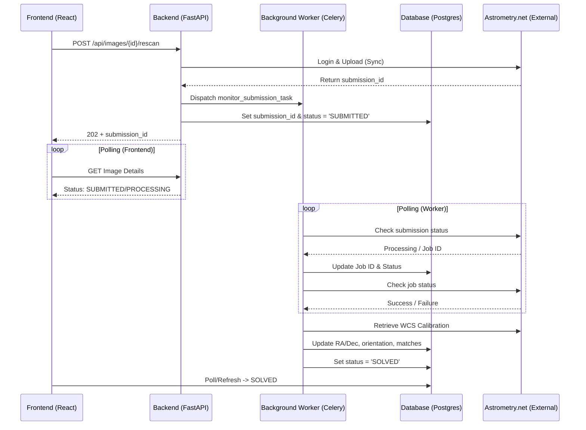

# Astrometry.net Rescan Process Documentation

This document describes the end-to-end technical workflow for the "Rescan" feature, which utilizes Astrometry.net to plate-solve images and update their celestial coordinates and metadata.

## Overview

The process is designed as an asynchronous background task to handle potentially long processing times (ranging from 1 to 10 minutes) on the Astrometry.net servers without blocking the user interface.

## Architecture

## Step-by-Step Workflow

### 1. Trigger (Frontend)
The user clicks the **"🔭 Start Rescan"** button on the `ImageDetail` page. This sends a POST request to the backend.

### 2. Synchronous Upload (API)
The FastAPI endpoint executes the upload directly to ensure immediate feedback:
- **Environment Check**: Verifies `ASTROMETRY_API_KEY`.
- **Upload**: Calls the `AstrometryService` to upload the file to `nova.astrometry.net`.
- **Response**: Upon successful upload, it receives a `submission_id` and immediately returns it to the frontend with a `SUBMITTED` status.
- **Task Dispatch**: Simultaneously, it queues a **Celery Task** (`monitor_submission_task`) to handle the long-running polling.

### 3. Polling (Frontend)
The frontend receives the `submission_id` and enters a polling mode, refreshing the image details every 5 seconds to show progress (Status changes from `SUBMITTED` -> `PROCESSING` -> `SOLVED`).

### 4. Background Monitoring (Worker)
The `monitor_submission_task` runs in the background:
- **Submission Check**: Polls the API to see if the submission has been assigned a `job_id`.
- **Job Check**: Once a job starts, it polls for the final status (`success` or `failure`).

### 5. Results Retrieval & DB Update
Once the job succeeds:
- **Calibration**: Downloads the WCS (World Coordinate System) data (RA, Dec, Pixel Scale, Rotation).
- **Database**: Updates the `Image` record with the new coordinates and sets `is_plate_solved = True`.
- **Geometry**: Updates the PostGIS `center_location` for spatial search.
- **Catalog Matching**: Automatically triggers a re-run of the local catalog matcher to identify objects (Messier/NGC) based on the new coordinates.

## Error Handling

- **Automatic Retries**: The Celery task is configured to auto-retry up to 5 times for transient network errors.
- **Status Updates**: If a terminal failure occurs (e.g., API login fail, image won't solve), the database status is set to `FAILED`.
- **Cleanup**: Temporary JPG files are deleted regardless of success or failure.

## Configuration

The system supports two plate-solving providers, configured in the `.env` file:

### Remote (Astrometry.net)
- `ASTROMETRY_API_KEY`: Your API key from [nova.astrometry.net](http://nova.astrometry.net/api_help).

### Local (StellarSolver-API)
- `LOCAL_ASTROMETRY_URL`: URL of the local solver (e.g. `http://localhost:8000/api`).
- `LOCAL_ASTROMETRY_API_KEY`: API key for the local solver.

The system checks settings to determine which provider to use. If a local solver is configured, it will be used instead of the remote service.
